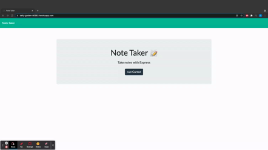

# Note Taker

## Description

This Note taker app allows users to store notes with a title and also write their text right underneath it. It allows users to save multiple notes which can be viewed by the left of the screen.

## Table of Contents
* [Installation](#Installation)
* [Usage](#Usage)
* [Languages Used](#Languages-Used)
* [Dependencies Used](#Dependencies-Used)
* [Deployed Links](#Deployed-Links)
* [User Story](#User-Story)
* [Mockup](#Mockup)

## Installation

In other to install the Note taker you have to make sure to install the npm packages and dependencies used in the package.json file. Express and uuid dependencies must be installed to run the application. Then run node server.js in the console to launch the server so you can view the app on the browser
## Usage
To use the app start by running `npm i` in the console to install the modules needed for the app to function properly. Then, run `npm i express` to install the express dependency if you havent installed it followed by `npm i uuid` to install the id dependency which allows to match every note stored with a unique id.
## Languages Used
* HTML
* CSS
* Express.js
## Dependencies Used
  * Express
  * UUid
  * Fs(file system)
  * Path
## Deployed Links
* [Heroku App](https://salty-garden-90952.herokuapp.com/)
* [Github Repo](https://github.com/Daniel-ipymb/Note-Taker)
## User Story
* WHEN i type in a NOTE, I WANT to save it and view my previous note on the screen.
* I WANT to open a new note so i click on the new file button on the top and a new blank file opens. I WANT to view my previous notes so i click on them and it opens up on the screen. I WANT to delete a note so i click on the delete button and the notes gets deleted.
## Mockup
Below is a mockup of the Note taker application;

  